# 🚀 DevSecOps E-Commerce CI/CD Pipeline

> **An end-to-end, enterprise-grade Java E-Commerce DevSecOps CI/CD pipeline featuring Jenkins, Maven, SonarQube, Nexus, Trivy, Docker, AWS EKS, and Kubernetes.**

---

## 📊 Pipeline Status & Tech Stack

| Category | Tools & Status |
| :--- | :--- |
| **CI/CD & Automation** |   |
| **Runtime & Language** |   |
| **Orchestration & Cloud** |   |
| **Security & Quality** |   |

---

## 📌 Executive Summary

This architecture implements a fully automated, secure **DevSecOps CI/CD pipeline** for a Java-based E-Commerce web application.

A developer push to **GitHub** triggers a **Jenkins** pipeline via webhook, executing the following workflow:


```

[1] Source Checkout  ➜  [2] Maven Compile  ➜  [3] SonarQube Quality Gate
│
[6] Trivy FS Scan    ↖  [5] Nexus Artifact ↖  [4] Maven Package
│
▼
[7] Docker Build     ➜  [8] Trivy Image Scan ➜  [9] Push to Docker Hub
│
[12] Live App        ↖  [11] LoadBalancer  ↖  [10] Deploy to AWS EKS

```

### 🎯 Primary Objective
**Automate the complete lifecycle:** Source Code ➔ Static Analysis ➔ Artifact Storage ➔ Containerization ➔ Vulnerability Scanning ➔ Orchestration ➔ Live Application.

---

## 🏗️ Interactive Architecture

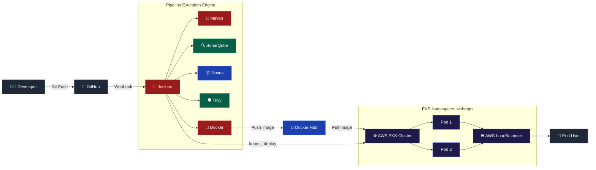

---

## 🧰 Technology Stack Reference

| Technology | Role & Function in Pipeline |
| --- | --- |
| **GitHub** | Source Code Management (SCM) & Webhook triggers |
| **Jenkins** | Automation server orchestrating the CI/CD pipeline |
| **Maven & Java 17** | Application compilation, dependency management, and build packaging |
| **SonarQube** | Static Application Security Testing (SAST) & Quality Gate verification |
| **Nexus Repository** | Binary artifact repository for Maven WAR files |
| **Trivy** | Vulnerability scanning for project filesystem & Docker container images |
| **Docker & Docker Hub** | Multi-stage image build & container registry management |
| **AWS EKS & kubectl** | Managed Kubernetes cluster hosting containerized workloads |
| **AWS Load Balancer** | Ingress and traffic management for public application access |

---

## 📁 Repository Anatomy

```text
ECommerce-App/
├── 📄 Jenkinsfile              # Pipeline-as-Code execution definition
├── 📄 Dockerfile               # Multi-stage build definition (Maven + Tomcat)
├── 📄 deployment-service.yaml  # K8s Deployment & LoadBalancer Service spec
├── 📄 pom.xml                  # Maven dependencies & build configurations
├── 📂 src/                     # Java application source code
└── 📂 target/                  # Compiled WAR build artifacts

```

---

## ⚙️ CI/CD Stage Breakdown

```groovy
stage('Git Checkout') {
    steps {
        git branch: 'master', url: '[https://github.com/ab-inand/Ecommerce-App-.git](https://github.com/ab-inand/Ecommerce-App-.git)'
    }
}

```

* **Purpose:** Pulls fresh code directly from the GitHub repository to ensure state alignment.
* **Verification:** Executes `pwd && ls -la` to validate workspace context and critical files (`pom.xml`, `Dockerfile`).

```bash
mvn clean compile

```

* **Analysis Parameters:** Checks for security vulnerabilities, bugs, technical debt, code smells, and duplication.
* **Quality Gate Assertion:** Pipeline execution pauses until SonarQube validates quality standard thresholds:
```groovy
waitForQualityGate abortPipeline: true

```


```bash
# Packaging & Binary Upload
mvn package -DskipTests # Creates target/EcommerceApp.war
mvn deploy -DskipTests  # Uploads WAR to Nexus Repository

# File System Security Scan
trivy fs --severity HIGH,CRITICAL .

```

```dockerfile
# Multi-stage Dockerfile Design
# Stage 1: Build Application
FROM maven:3.8-openjdk-17 AS builder
COPY . /app
RUN mvn clean package -f /app/pom.xml

# Stage 2: Runtime Production Container
FROM tomcat:9.0-jdk17
COPY --from=builder /app/target/*.war /usr/local/tomcat/webapps/ROOT.war
EXPOSE 8080

```

* **Container Scan & Push:**
```bash
docker build -t abhi888a/ecommerce-app:latest .
trivy image --severity HIGH,CRITICAL abhi888a/ecommerce-app:latest
docker push abhi888a/ecommerce-app:latest

```


```bash
# Rolling Update Deployment on AWS EKS
kubectl rollout restart deployment/ecommerce-deployment -n webapps
kubectl rollout status deployment/ecommerce-deployment -n webapps --timeout=180s

```

#### Verification Metrics:

```bash
kubectl get pods,svc,deployment -n webapps

```

> **Expected Target State:**
> * Pods: `Running` (2 Replicas)
> * Deployment: `Available`
> * Service: `LoadBalancer` assigned with external AWS DNS
> 
> 

---

## 🔒 Security Lifecycle Integration

```text
       ┌────────────────┐      ┌────────────────┐      ┌────────────────┐
       │ Static Source  │      │ Dependency/FS  │      │ Container Scan │
       │  (SonarQube)   │ ───► │  (Trivy FS)    │ ───► │  (Trivy Img)   │
       └────────────────┘      └────────────────┘      └────────────────┘
               │                       │                       │
               ▼                       ▼                       ▼
         Quality Gate            Vulnerability           Image Registry
        Enforcement             Report Artifact          Access Control

```

---

## 📸 Screenshots & Audit Proof

Here is the visual verification and audit trail showing each stage of the DevSecOps CI/CD pipeline, AWS infrastructure setup, code quality checks, artifact management, and live Kubernetes deployment.

---

### 1. AWS Infrastructure (EC2 Instances)
> Active EC2 nodes hosting Jenkins, SonarQube, Nexus, and the AWS EKS worker nodes.

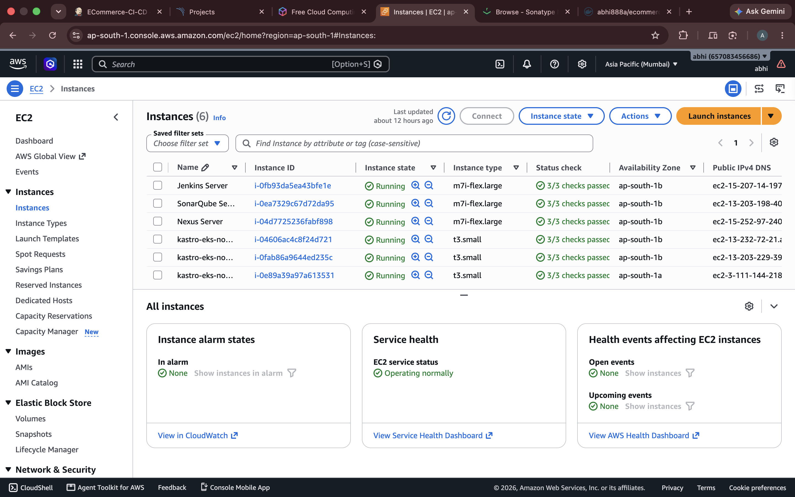

---

### 2. AWS EKS Cluster Status
> Active status and control plane details for the `kastro-eks` Kubernetes cluster provisioned in region `ap-south-1`.

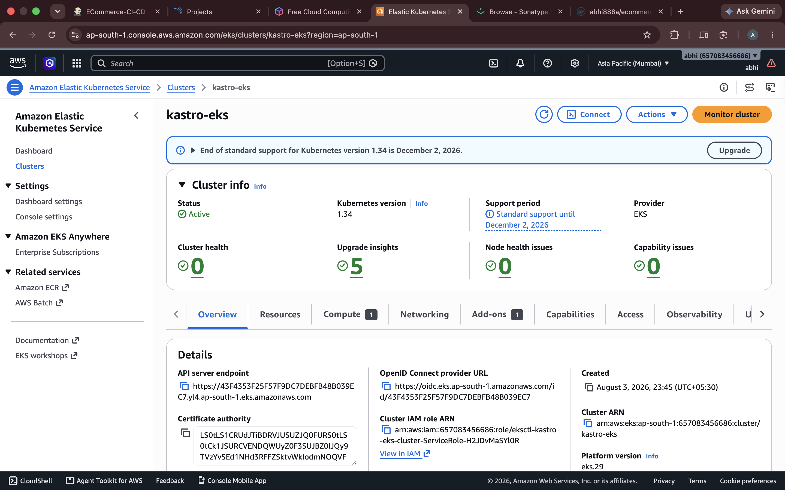

---

### 3. Jenkins CI/CD Pipeline Stages View
> Visual breakdown of all automated pipeline stages passing successfully from Git Checkout to EKS Deployment.

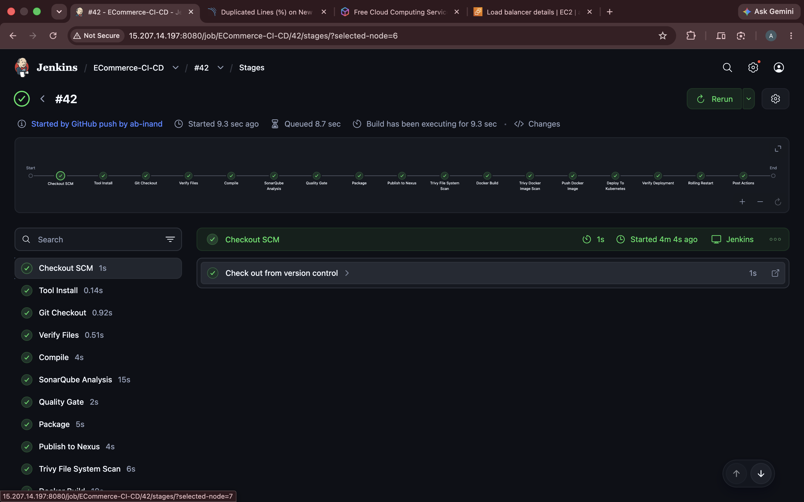

---

### 4. Jenkins Pipeline Console Output
> Terminal build execution logs showing the final status: `Finished: SUCCESS`.

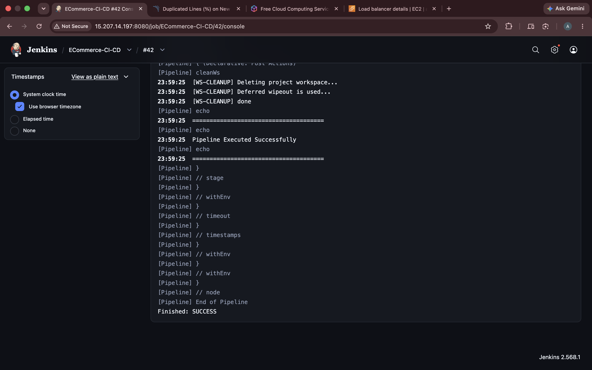

---

### 5. SonarQube Quality Gate Analysis
> Code quality and security report displaying bugs, vulnerabilities, code smells, and the `Passed` status for `ECommerce-App`.

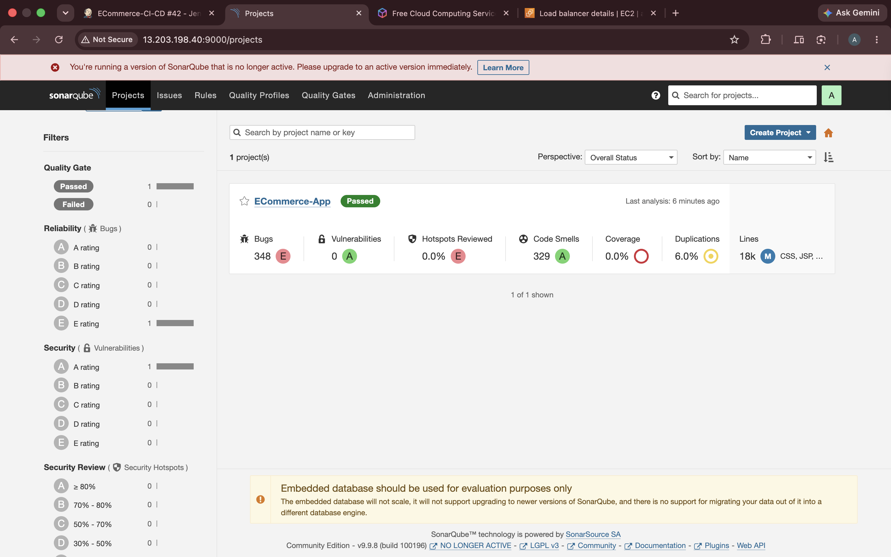

---

### 6. Nexus Artifact Repository
> Hosted Maven repository displaying stored `.war` artifacts inside `maven-public`.

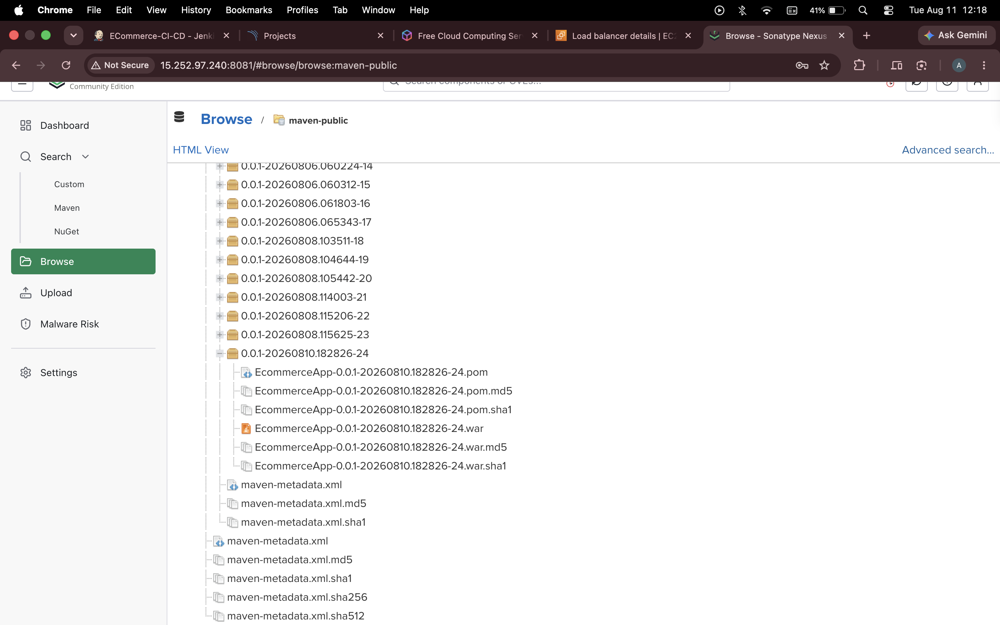

---

### 7. Jenkins Build Summary & Security Artifacts
> Archived security scanning reports (`trivy-fs-report.txt` & `trivy-image-report.txt`) alongside the SonarQube quality badge.

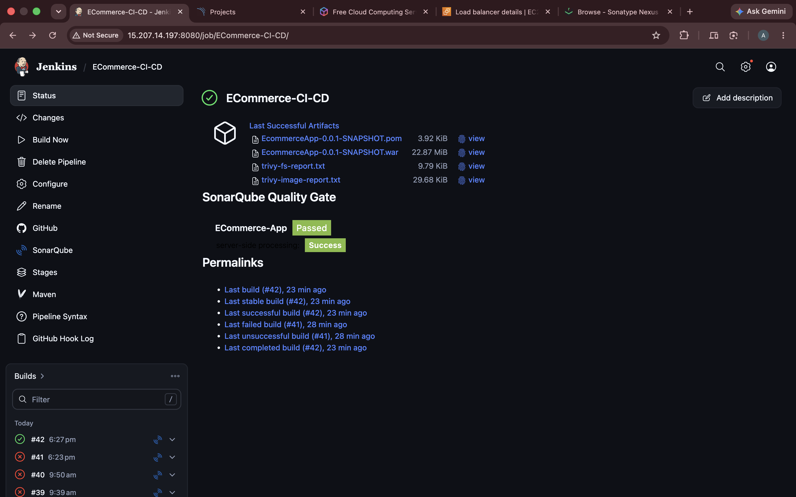

---

### 8. Docker Hub Image Registry
> Verification of the containerized image `abhi888a/ecommerce-app` pushed successfully with updated tags.

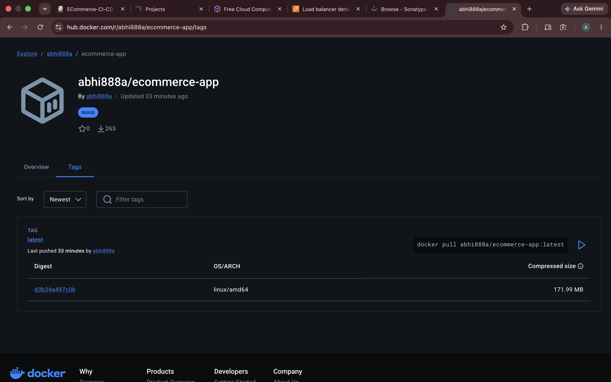

---

### 9. AWS Classic Load Balancer
> Provisioned Load Balancer console view managing external traffic to the EKS cluster nodes.

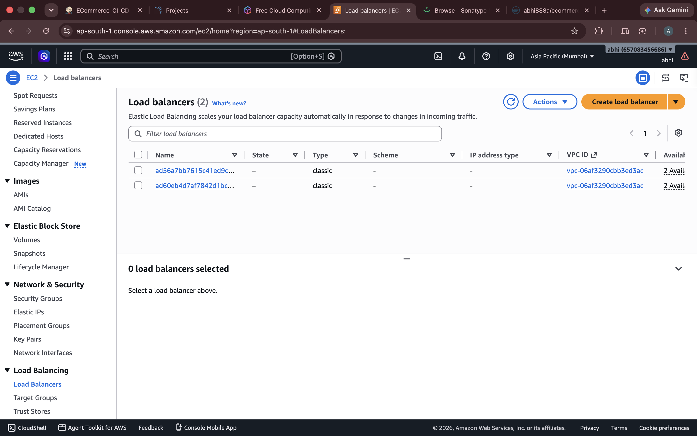

---

### 10. Kubernetes Cluster Verification via CLI
> Terminal CLI output confirming active pods, services, and deployments running in the `webapps` namespace (`kubectl get all`).

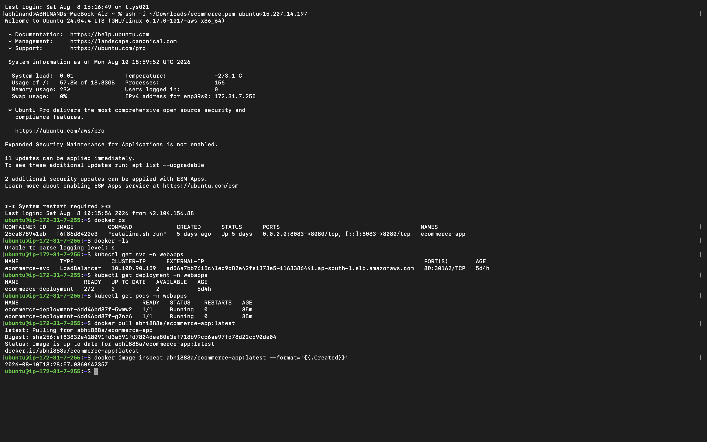

---

### 11. Live Application Verification
> Live browser output verifying the running E-Commerce web application accessible via the Load Balancer endpoint.


---

---

## ⚠️ Production Readiness Enhancements

> [!WARNING]
> While optimized for learning and demonstration, apply the following controls prior to production rollout:

1. **Tagging Policy:** Replace `latest` image tags with dynamic Git SHA tags (`${BUILD_NUMBER}-${GIT_COMMIT}`) for traceable rollbacks.
2. **Secret Management:** Externalize credentials using **AWS Secrets Manager** or **HashiCorp Vault**.
3. **Cluster Governance:** Implement Kubernetes **RBAC least-privilege policies**, NetworkPolicies, and Resource Quotas (`limits`/`requests`).
4. **State Persistence:** Migrate application data from embedded SQLite to a managed cluster instance such as **AWS RDS PostgreSQL**.

---

```

```
